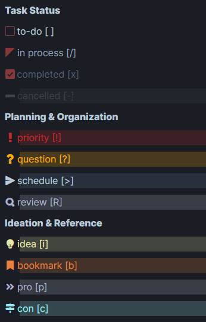
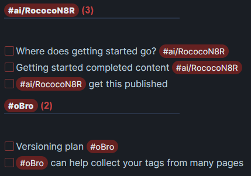
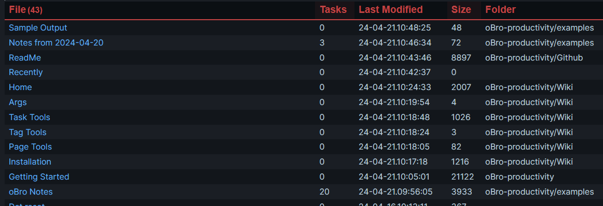

# oBro Productivity Tools — Wrangle Tasks and Tags  Like a Pro!

Welcome to the hub of organization, where chaos goes to die and productivity thrives. Say goodbye to hunting down elusive tags and wrangling scattered tasks – with oBro, you'll be in control like never before. oBro knows when you're in a meeting, ideas fly fast and furiously. There's no time to put ideas in the right file or tool. If you don't capture it in your current notes document, it could be forgotten. oBro does the work for you, collecting, filtering and organizing tasks and tags across your documents when you're ready. 

Alright, so listen up, this is just the beginning. We're talking baby steps in the grand scheme of things. Sure, we might not have all the bells and whistles just yet, but let me tell you why oBro is already miles ahead of the competition. 

## First, my gratuitous plead for help
Making magic happen isn't easy (or cheap). That's where you come in! If you're inspired and want to show some love, consider buying me a coffee ☕️ to keep the creativity flowing and the updates rolling. Every sip counts, and your support means the world. Let's fuel this productivity train together! 

<a href="https://www.buymeacoffee.com/RococoN8R" target="_blank"></a> or <a href="https://ko-fi.com/U7U0X6N0Q" target="_blank"></a>

## Recently Added Gizmos
Alright, alright, don't get too excited. We're just dipping our toes in the water here, folks. This is all we've rustled up — for now, at least. Take a peek and see if any of these babies can jazz up your productivity game!

### Tasks: Your New Ride or Die

Alright, let's talk tasks. Those pesky little things that can make or break your productivity flow. With oBro on your team, you're not just managing tasks – you're owning them. Add them to *any* Obsidian document in your vault, oBro collects them for you! Need to scope out your project? Easy peasy. Prioritizing like a pro? You got it. Brainstorming your next big idea? Absolutely. And with oBro, creativity flows smoother than butter on hot toast.


*Check the status of prioritized items. Here's a quick view of what's due, what's in progress and what was recently completed.*

Now buckle up -- oBro's got your back with all the task states you could dream of! Let's break down how they're sorted in each of the reports.



*Numerous task types are available, enabling tiered prioritization*

### Tags: Your Secret Sauce to Organization

Tags aren't just for decoration, my friend. They're your secret weapons in the battle against chaos. Dive into our tag system and unlock a whole new level of organization. Whether you're sorting tasks, embedding them in bullets, or just tidying up your digital mess, oBro's got your back.



*Tags are collected from you entire vault. Just click on one to go straight to the document*

### Bonus! Taming the Document Tsunami

Feeling like you're drowning in a stormy sea of documents? Can't remember which note you updated yesterday? Relax, oBro's got your back! Easily track down recently modified pages, saving you time and keeping you from going nuts trying to find them. Just click on the file to open a new tab!



*Add this to any document to easily find the documents you recently updated*


# Installation: Let's Get Started

1. Go to **Settings** in your [Obsidian](https://www.obsidian.md/). Then go to **Community Plugins** and disable **Safe Mode**. This enables JavaScript libraries to run in your plugins
2. Click on **Browse** and search for _**oBro**_
3. Click **Install**
4. Click the checkbox to enable the oBro plugin

## Required: add Dataview if you don't already use it

If you don't already use it, you need to add the plugin and enable it.

5. In **Community Plugins**, click on **Browse** and search for _**Dataview**_. This plugin provides data views powering oBro
6. Click **Install**
7. Click the checkbox to enable the Dataview plugin

## Recommended, but optional

_**Tasks**_, by *Clare Macrae*, adds due dates, recurring tasks, done dates and sub-set of checklist items. 

8. In **Community Plugins**, click on **Browse** and search for _**Tasks**_. 
9. Click **Install** 
10. Click the checkbox to enable the Tasks plugin


# Basic Usage: Let's Do This!

## The Basics: Consistency is Key

Alright, listen up, productivity wizard! Using oBro is easy peasy (and we don’t throw those words around lightly). Our tools integrate seamlessly with any Obsidian markdown document (yep, your notes). No need to mess with Front Matter or JavaScript code. Just slap these 5 lines (yep, that includes 2 blank ones) into your doc to see prioritized tasks from your entire Vault. Want to try another tool? Just swap out `viewTasksPrioritized(dv)` with one of the other Task, Tag, or Page tools below!

```
```dataviewjs

viewTasksPrioritized(dv)

```­
```


Ready for some advanced maneuvers? Check out our [[#Advanced: Arguments with Purpose]] section to get the lowdown on custom search paths, tags and more. You can even hide files and directories from your search, easily. With oBro, you’re the boss. Time to whip those tasks into shape! 

## Tasks: Wrangling the Chaos

So, ready to tame the beast that is task management? Here's what you can do:

**Manage Priorities Like a Pro**: Use `viewTasksPrioritized(dv)` to see what’s on your plate. Get lists of overdue, due this week, due next week, in progress, and recently completed tasks to keep your priorities straight.

**Plan Like a Boss**: Ready to dive in? `viewTasksPlanning(dv)` lays it all out for you. From managing priorities and tackling open questions to scheduling items, reviewing tasks and managing backlog,  it's your one-stop-shop for getting things done.

**Ideate Away**: Feeling inspired? `viewTasksIdeation(dv)` is where your creative juices flow. Ideas, bookmarks, pros, cons – it’s all there, waiting for you to bring them to life. No perseverating required!

But wait, there's more! Use `helpTasks(dv)` to discover other recent Task tools, like task counts by stage.

So, ready to get your productivity game on point? Dive in, explore, and let oBro do the heavy lifting. You've got this!

## Tags: Coalescing the Power

Ah, the mighty hashtag. You either love 'em or you don't know what you're missing!

Picture this: you're furiously jotting down notes, your mind jumping from one brilliant idea to the next. Topics shift, ideas flow, and before you know it, you're left with a chaotic mess. Can you capture each idea in perfectly organized notes? Not a chance. Most ideas end up forgotten, buried in the chaos.

And it gets worse. You've captured a goldmine of ideas in one note. Now what? Got hours to spare for organizing these nuggets into other documents, duplicating them for various projects, people, and categories? Or do you just leave it all there, hoping you'll find it later? Spoiler alert: you won't.

**Organize with Tags**: Meet your new best friend, `viewTags(dv)`! This tool collects all the tags in your Vault – topics, discussion points, projects, people, you name it. Every task with the same tag is neatly gathered together. Click on a tag to jump straight to the note and task. Or, if you're feeling super productive, click the checkbox to mark it done faster than you can say "Hashtag blessed."

Got tags in list items (bullets) that aren't tasks? No worries! Check out our [[#Advanced: Arguments with Purpose]] section to learn how to reveal those items, customize search paths, and more.

Hungry for more? Use `helpTags(dv)` to uncover other awesome Tag tools we've recently added. Let's get tagging and transform that chaos into order!

## Pages: Find Your Notes Faster

PKM - a blessing and a curse, am I right? Lucky for you, oBro has your back by helping you find those recently updated notes faster than you can say "productivity overload!"

**View Recently Updated Pages**: Wanna see what you've been up to lately? Use `viewPagesRecent` to get a rundown of all your recent activity. You'll see all your documents listed in descending order, complete with the number of tasks in each. Just click on the file name to open it in a new tab. Easy peasy!

But wait, there's more! Need extra deets or want to stay ahead of future updates? Hit up `helpPages(dv)` to dive into all the juicy features oBro has in store. Stay sharp, stay organized, and let oBro do the heavy lifting.

## Advanced: Arguments with Purpose

Alright, it's time to get serious. Dive deep into oBro's data and querying features – your trusty GPS for navigating the vast wilderness of your documents. Find what you need, take action, and get back to conquering the world in record time. Let’s get this productivity party started!

**`searchTags`**
*Filter tags by starting text*

**Examples**
`{searchTags: '#Proj1'}` displays tags starting with #Proj1
`{searchTags: ['#Proj1', '#Proj2']}` use an array to list multiple tags
`{searchTags: ''}` displays all tags
Omitting the argument displays all tags

**Pro Tips**
Consider tagging projects, discussion points, action items and other categories using a consistent format. For instance, `#p/NAME` for projects (replace NAME with the project name), `#d/NAME` for people you want to discuss items with, and `#ai/NAME` for action items. Use `{searchTags: '#d/'}` to list all discussion points with each name, and `{searchTags: '#d/Mandy'}` to list just those with Mandy.


**`viewListItems`**
*Include tags in list items/bullets*

By default, only tags in tasks are displayed. Tags in list items (bullets) are excluded from the search.
Set the argument to `true` to include list items in the search.

**Example**
`{viewListItems: true}`


**`searchPath`**
*Filter the results by custom file path*

**Examples**
`{searchPath: '.'}` searches just the current page
`{searchPath: '"path/to/folder"'}` searches a specified folder and its subfolders
Omitting the argument searches all folders in the Vault


**`viewHiddenFiles`**
*Include hidden files in the search*

So this isn't about the files your computer's operating system hides. By default, oBro skips files and directories starting with an underscore `_`. This helps "hide" archive information or other items you don’t generally want in your searches. But if you need to search those hidden files, just add `{viewHiddenFiles: true}` to the arguments.

**Example**
`{viewHiddenFiles: true}`

Ready to level up your productivity game? With these advanced features, oBro puts you in the driver’s seat. Navigate your Vault like a pro, take control of your data, and get back to ruling the world, one task at a time. Let’s do this!

## Settings: Hidden Secrets to Change Defaults

Hey there, champ! We know oBro's trying to get it right, but sometimes defaults just don't cut it for everyone. Wanna tweak those settings to make oBro truly yours? Whether it’s adjusting defaults for arguments like search paths or tags, or even the size of header text, we’ve got you covered. Here’s how to uncover these hidden secrets:

1. Go to **Settings** in your [Obsidian](https://www.obsidian.md/). Then go to **Community Plugins** and disable **Safe Mode**. This enables JavaScript libraries to run in your plugins
2. Click on the **Settings Gear** and and make your updates

Boom! That’s it. Customize to your heart’s content and make oBro work exactly the way you want it to. Easy peasy, lemon squeezy!

# Contributing: We're Better Together

Calling all organization aficionados! Got ideas, bugs to squash, or just wanna chat? Hit us up. We're all about making oBro even more epic, one brainstorm at a time. Got a killer feature in mind? Don't hold back – let's make some magic happen together. The [discussion is here](https://github.com/RococoN8R/oBro-productivity/discussions).

# Support: Spread the Love

If oBro has been your saving grace and you're feeling the love, why not show us some support? Donations keep our motivation sky-high and help fuel future updates. But hey, no need for bribery – we're in it for the love of organization, not the dough. We're cool like that.

<a href="https://www.buymeacoffee.com/RococoN8R" target="_blank"></a> or <a href="https://ko-fi.com/U7U0X6N0Q" target="_blank"></a>

Curious about the license? Here's the oBro-productivity, aka oBro, [AGPL-3.0 license](https://github.com/RococoN8R/oBro-productivity?tab=AGPL-3.0-1-ov-file).

So there you have it, folks – your crash course in all things oBro. Ready to revolutionize the way you work? Let's make productivity history together!
